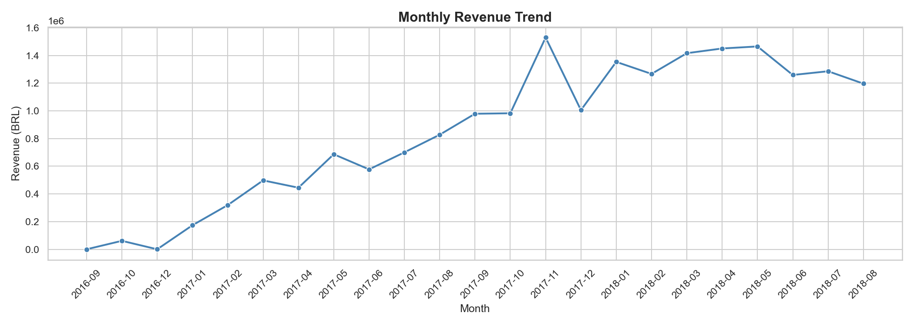
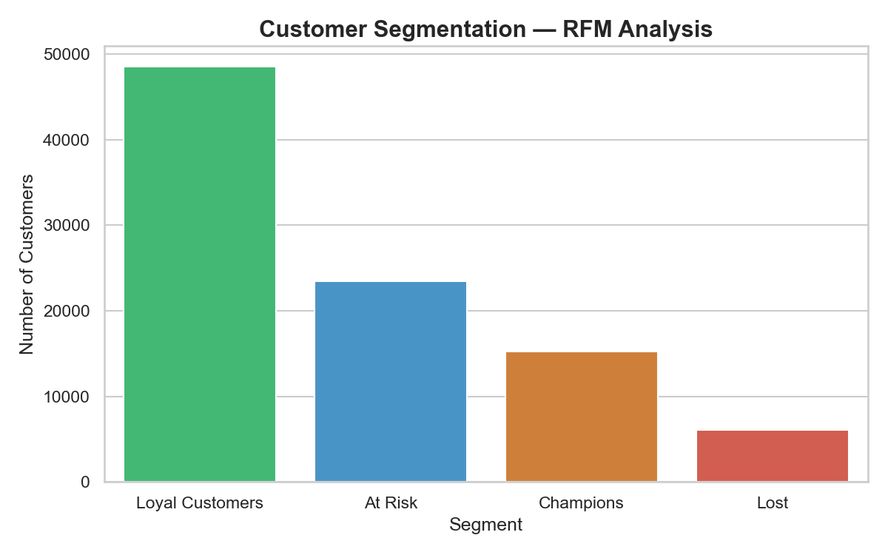

# 🛒 E-Commerce-Customer-Analysis-

## 📌 Project Overview
Analyzed real-world Olist e-commerce dataset to perform 
RFM customer segmentation and revenue trend analysis.

## 🛠️ Tools Used
Python | Pandas | NumPy | Matplotlib | Seaborn

## 📊 Key Insights
- Cleaned 10,000+ row dataset
- Segmented 90,000+ customers using RFM Analysis
- Identified top 15% high-value (Champion) customers
- Visualized monthly revenue trends and delivery performance

## 📁 Files
| File | Description |
|------|-------------|
| `ecommerce_analysis.ipynb` | Main Jupyter Notebook |
| `rfm_output.csv` | RFM Segment Results |
| `monthly_revenue_output.csv` | Monthly Revenue Data |

## 📷 Charts

## 📂 Dataset
[Olist Brazilian E-Commerce - Kaggle](https://www.kaggle.com/datasets/olistbr/brazilian-ecommerce)

---
*By Singh Rohitkumar Rajkumar | MCA | Bhagwan Mahaveer University, Surat*
